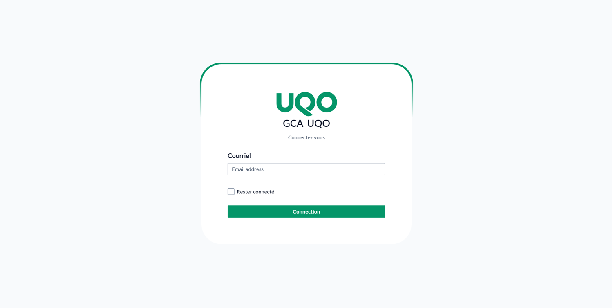
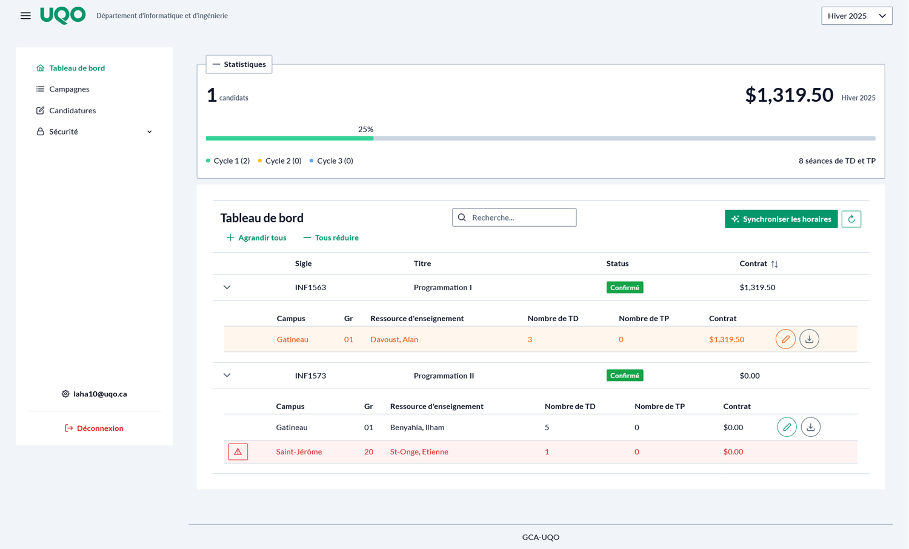
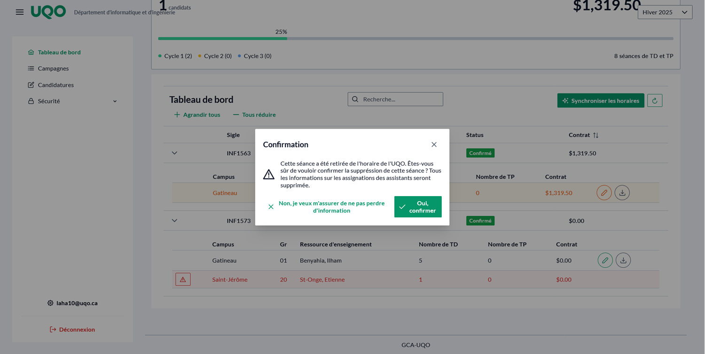
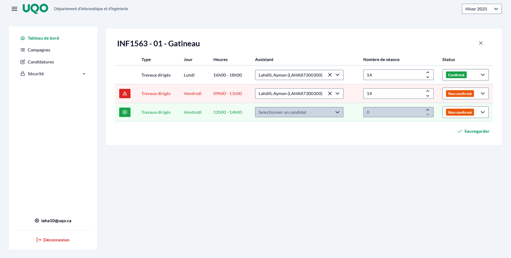
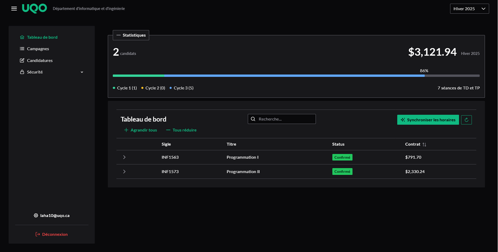
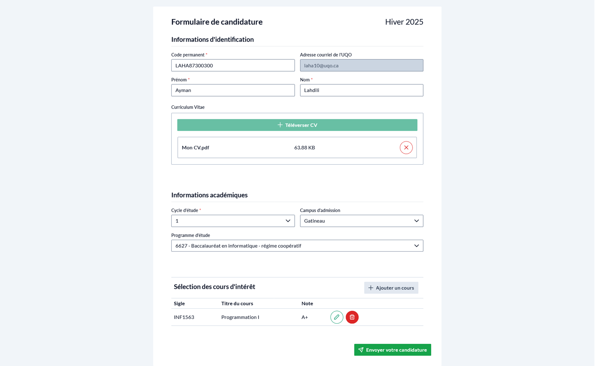
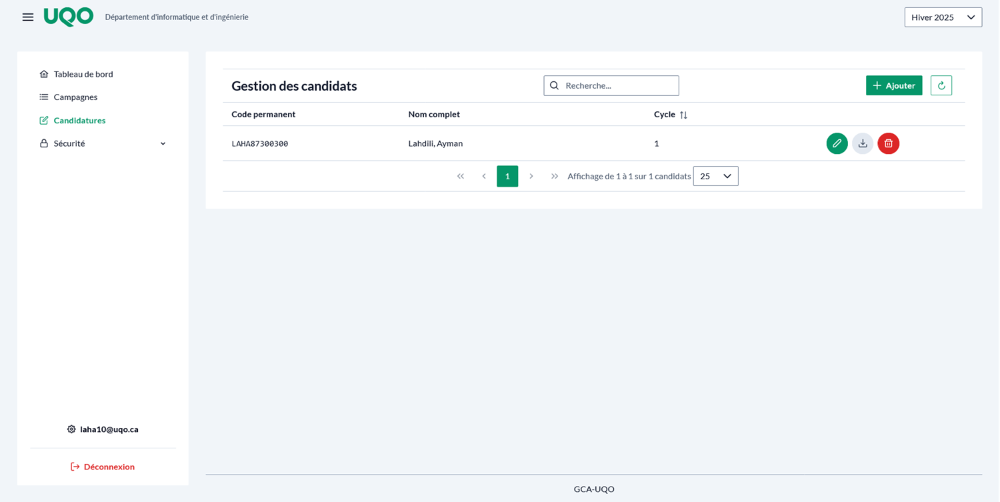

# GCA-UQO

The UQO Candidate Management System (GCA-UQO) 

## Key Features

1. Schedule & Session Management: Automates the tracking and updating of course schedules, lab sessions, and student lists to reduce manual errors and save time. In sync with the UQO's website.
2. Application Processing: Extracts and organizes data from student application forms and CVs, eliminating repetitive manual entry tasks.
3. Budget & Contract Calculation: Computes contract amounts based on session counts and student academic levels (undergraduate, master’s, PhD), streamlining multi-system operations.

## Tech Stack

- ⚡ [**FastAPI**](https://fastapi.tiangolo.com) for the Python backend API.
    - 🧰 [SQLModel](https://sqlmodel.tiangolo.com) for the Python SQL database interactions (ORM).
    - 🔍 [Pydantic](https://docs.pydantic.dev), used by FastAPI, for the data validation and settings management.
    - 💾 [SQLite](https://www.sqlite.org/) as the SQL database.
    - **Response caching**
    - **Made for concurrency first**
- 🚀 [Vue](https://vuejs.org/) for the frontend.
    - 💅 [PrimeVue](https://primevue.org) as the component library.
    - 🌀 [TailwindCSS](https://tailwindcss.com) + `tailwindcss-primeui` for utility-first styling and theming.
    - 📦 [Vite](https://vitejs.dev) for frontend bundling.
    - 🌗 Dark mode support via Tailwind + PrimeVue themes.
- 🐋 [Docker Compose](https://www.docker.com) for containerized development and production.
- ✅ Tests with [Pytest](https://pytest.org).
- 📞 [Nginx](https://nginx.org/) as a reverse proxy / load balancer.

## How to run it yourself

* Start the local stack with Docker compose:

    ```bash
    docker-compose up --build
    ```

* Now you can open your browser and interact with these URLs:
    * Frontend, built with Docker, with routes handled based on the path: http://localhost
    * Backend, JSON based web API based on OpenAPI: http://localhost:8000
    * Automatic interactive documentation with Swagger UI (from the OpenAPI backend): http://localhost:8000/docs

## Backend Design Patterns

The design pattern used throughout the backend is heavily inspired by the recommandation of the Rubin Observatory Science Quality and Reliability Engineering team (see [One design pattern for FastAPI web applications](https://sqr-072.lsst.io/)).

## Frontend

### Login

> ❗ There is no user management in this version. You can simply "login" by entering any email with the login pages of this application.



### Dashboard






### Student




### Budget and Campagne management


